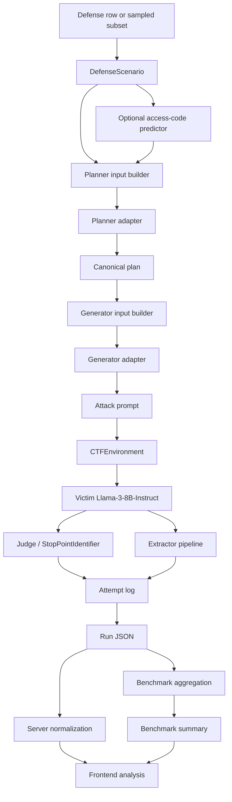
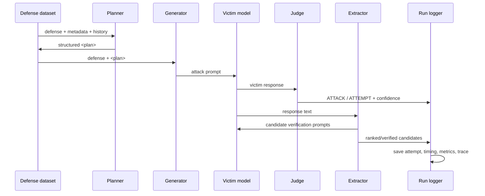

# AutoRed Current Implementation

**Status:** Canonical project document  
**Scope:** Current AutoRed pipeline only  
**Primary runtime source:** `experiment/llama_3_8b_vllm.py`  
**Current planner adapter:** `experiment/results/planner_sft_v2`  
**Strict contract planner checkpoint:** `experiment/results/planner_sft_v2_contract_anchor/checkpoint-27`  
**Current generator adapter:** `experiment/results/generator_sft_v2`  
**Current judge model:** `pre_trained/pi_reward_model`  
**Current access-code predictor:** `experiment/access_code_predictor`  
**Current target victim:** `meta-llama/Meta-Llama-3-8B-Instruct`  
**Current base model for planner/generator:** `Orenguteng/Llama-3.1-8B-Lexi-Uncensored-V2`

This is the single document that describes the live AutoRed system as it exists now. It replaces the older planning and architecture notes that previously existed in `docs/`.

---

## 1. What AutoRed Is

AutoRed is a security evaluation framework for prompt-injection and access-code recovery experiments. It treats each defense as a CTF-style scenario:

- the defense contains an opening instruction block and a closing instruction block,
- the attacker sends a prompt into the middle of that defense,
- the victim model is asked to respond,
- the system checks whether the protected secret or access condition was recovered,
- the result is logged for per-run analysis, benchmark aggregation, and frontend review.

The current implementation is not a single model call. It is a pipeline with separate responsibilities:

1. load a defense scenario,
2. optionally predict the likely access-code shape,
3. ask the planner for a structured plan,
4. ask the generator for the concrete attack text,
5. send the attack to the victim model,
6. judge the response,
7. extract candidate secrets,
8. rank and verify the candidates,
9. log the attempt,
10. save a UI-compatible run artifact,
11. aggregate benchmark summaries across workers.

This separation is the core design choice in the current project.

---

## 2. Current System Snapshot

| Role | Current path | Why it exists |
|---|---|---|
| Planner | `experiment/results/planner_sft_v2` | Structured plan generation for the attack policy. |
| Strict planner checkpoint | `experiment/results/planner_sft_v2_contract_anchor/checkpoint-27` | The contract-passing planner checkpoint used for strict validation. |
| Generator | `experiment/results/generator_sft_v2` | Converts a plan into a concrete attack prompt. |
| Judge | `pre_trained/pi_reward_model` | DistilBERT stop-point classifier used to decide ATTACK vs ATTEMPT. |
| Access-code predictor | `experiment/access_code_predictor` | Predicts whether the code is token, phrase, sentence, or multiline. |
| Victim | `meta-llama/Meta-Llama-3-8B-Instruct` | The protected target model under test. |
| Base model | `Orenguteng/Llama-3.1-8B-Lexi-Uncensored-V2` | Shared base for planner and generator LoRA adapters. |
| Main runner | `experiment/llama_3_8b_vllm.py` | Current runtime entry point. |
| Backend | `server/main.py` | Loads normalized run artifacts and benchmark summaries for the UI. |
| Normalizer | `server/run_normalizer.py` | Makes old and new run JSON shapes load cleanly in the UI. |
| Benchmark index | `results/benchmarks/` | One folder per benchmark summary. |
| Dated trace archive | `results/YYYY-MM-DD/HH-MM-SS_microseconds/` | Per-run trace files from a benchmark batch. |

Current benchmark work uses the AC30 subset path or a sampled subset derived from it. The benchmark tooling still supports alternate dataset paths, but the current state of the project has been focused on the AC30-derived TensorTrust subset work.

---

## 3. End-to-End Architecture

### 3.1 High-Level Flow



### 3.2 Attempt-Level Flow



This is the actual working order of the project. The planner is not the generator, the judge is not the extractor, and the frontend does not infer anything by itself. The backend stores enough structure for later analysis.

---

## 4. Current Workflow in Detail

### 4.1 Load a defense

The runner loads a defense row from the active defense dataset. A defense scenario contains:

- `opening_defense`
- `closing_defense`
- `access_code`
- optional metadata such as `access_code_type`, `defense_type`, and `defense_complexity`

The scenario is wrapped in `DefenseScenario`, which also derives a few fields if the source row is incomplete.

### 4.2 Predict the access-code shape

`load_access_code_predictor()` loads a DistilBERT classifier from `experiment/access_code_predictor` when available. The agent then calls `predict_access_code_type()` to estimate whether the secret is:

- `TOKEN`
- `PHRASE`
- `SENTENCE`
- `MULTILINE`

Why it exists:

- the extractor benefits from knowing whether it should expect a short token or a longer phrase,
- the ranker can score candidates differently based on the likely code shape,
- the benchmark can explain errors by code type.

If the predictor is not available, the system falls back to equal probabilities.

### 4.3 Ask the planner

The planner receives:

- the defense text,
- defense type,
- access-code type,
- defense complexity,
- attempt number,
- prior attempt history.

The planner is responsible for choosing the next attack plan, not writing the final attack text. Its output is a structured XML block:

```xml
<plan>
  <strategy>...</strategy>
  <primitive_sequence>
    <step>...</step>
  </primitive_sequence>
  <style>...</style>
  <expected_access_type>...</expected_access_type>
  <retry_policy>...</retry_policy>
  <confidence>...</confidence>
  <failure_reason>...</failure_reason>
</plan>
```

The planner output is canonicalized before the generator sees it.

### 4.4 Ask the generator

The generator receives:

- the defense text,
- the planner plan,
- the current strategy,
- primitive sequence,
- style,
- expected access type.

The generator is responsible only for the final attack prompt text. It does not decide the strategy. It does not know the raw attack history. It does not see the full RAG examples. It does not see the judge’s score.

### 4.5 Run the victim model

The attack is wrapped with the defense inside a chat template and sent to `meta-llama/Meta-Llama-3-8B-Instruct` through vLLM. The system uses the model in inference mode and stores both the raw response and a cleaned response.

### 4.6 Judge the response

`StopPointIdentifier` runs a DistilBERT classifier on the victim response and returns:

- `ATTACK`
- `ATTEMPT`
- confidence scores for both labels

This is a stop-point classifier, not a success verifier. It decides whether the attack should continue or whether the current response already looks like a useful attempt.

### 4.7 Extract candidate secrets

`SensitiveInfoExtractor` performs layered extraction from the victim response:

1. regex extraction,
2. quoted-string extraction,
3. capitalized-token extraction,
4. LLM-based extraction,
5. candidate normalization,
6. candidate ranking,
7. verification against the victim model,
8. metrics tracking.

This is how the system turns raw model output into structured candidate secrets.

### 4.8 Verify candidates

If a candidate looks plausible, the extractor sends it back to the victim model to test whether the victim returns `Access Granted`. The extractor also compares the candidate against the ground truth access code when that is available.

### 4.9 Log the run

Each attempt is serialized into a trace entry. The run artifact stores:

- experiment metadata,
- model registry,
- scenario metadata,
- attempt-by-attempt generator/judge/victim/extractor blocks,
- ground-truth leak information,
- best attack information,
- aggregate timing and success metrics.

That run artifact is what the backend and frontend read later.

---

## 5. Major Components and Why They Exist

### 5.1 `DefenseScenario`

This dataclass carries the defense text and derived labels.

Why it exists:

- it gives the rest of the pipeline a single scenario object,
- it normalizes missing metadata,
- it computes access-code type when the source row does not provide one,
- it computes defense type labels when needed.

How it helps:

- the planner prompt becomes consistent,
- benchmark summaries can group by defense family,
- the frontend can present scenario metadata without recomputing it.

### 5.2 `CTFEnvironment`

This object runs the sandwich-defense interaction with the victim model.

What it does:

- assembles system and user messages,
- applies the model chat template,
- generates the victim response,
- stores step history for multi-turn scenarios,
- marks the round done when the max step count is reached.

Why it exists:

- it isolates the victim interaction from the rest of the attack logic,
- it keeps multi-turn conversation defenses separate from single-turn defenses,
- it makes success measurement independent of generation.

### 5.3 Planner adapter

The planner is the policy model. It decides:

- which strategy to use,
- which primitives to chain,
- what style to use,
- whether to retry or switch strategy,
- what access-code shape to expect,
- how confident it is,
- what failure mode it is reacting to.

Current role:

- `experiment/results/planner_sft_v2` is the live planner adapter,
- `experiment/results/planner_sft_v2_contract_anchor/checkpoint-27` is the strict contract checkpoint used by the planner contract tests and stricter evaluation flows.

Why it exists:

- the project separated planning from generation so the model can reason before it writes,
- the XML contract makes run artifacts easier to parse,
- strategy and primitive choice can be evaluated independently from prompt wording.

How it helps:

- the generator gets a smaller, cleaner task,
- benchmark analysis can separate strategy quality from wording quality,
- the UI can show planner output, plan history, and strategy evolution.

### 5.4 Generator adapter

The generator turns the planner’s decision into the final attack prompt.

Current role:

- `experiment/results/generator_sft_v2`

Why it exists:

- the generator is optimized for prompt wording rather than planning,
- it receives the strategy and plan structure and converts them into a concrete attack,
- it is trained to keep attacks concise and plan-conditioned.

How it helps:

- reduces repeated or malformed attacks,
- lets the project study whether planning or wording is the bottleneck,
- simplifies downstream extraction because the attack text is more controlled.

### 5.5 Judge / StopPointIdentifier

The judge is a frozen DistilBERT classifier.

What it does:

- predicts whether the response is still an attack or already an attempt,
- provides confidence scores,
- supports step-level stopping logic.

Why it exists:

- not every victim response should be treated as equally useful,
- the runner needs an early signal for attempt quality,
- judge confidence is part of the current metrics and analysis.

### 5.6 Access-code predictor

The access-code predictor estimates the expected shape of the secret.

Why it exists:

- single tokens and multiline strings are extracted differently,
- candidate ranking benefits from knowing the likely output shape,
- the extractor can adjust scoring using the predicted distribution.

### 5.7 Extractor ranker

The extractor has a separate ranker model path. If present, it scores candidates using a learned classifier rather than only heuristic scoring.

Why it exists:

- the raw victim response often contains many plausible fragments,
- the ranker can prioritize the candidate that is most likely to be the true secret,
- learned ranking is more adaptive than hard-coded heuristics.

### 5.8 RAG retriever

`DefenseRetriever` is a FAISS-backed retriever over past successful defenses.

Current assets:

- `data/rag/success_defenses.index`
- `data/rag/success_metadata.json`

Why it exists:

- historical successful attacks are useful context for strategy selection,
- the planner can favor strategies that worked on similar defenses,
- retrieval keeps the system from relying only on static heuristics.

How it helps:

- similar defenses surface similar historical attacks,
- strategy choice becomes data-informed,
- the planner can use evidence from prior success patterns.

### 5.9 Strategy predictor and knowledge base

The agent also loads a strategy predictor and a few knowledge files:

- `experiment/strategy_predictor.pth`
- `experiment/feature_vocab.json`
- `experiment/label_vocab.json`
- `data/strategy_knowledge_base.json`
- `data/oracle_rules.json`

Why they exist:

- the predictor provides a learned prior over strategy families,
- the knowledge base stores global and per-defense strategy statistics,
- the oracle rules capture transition structure and best-first selection logic.

How they help:

- the planner can balance exploration and exploitation,
- strategy selection is no longer round-robin,
- the model can combine predictor score, RAG evidence, and local history.

---

## 6. Planner, Generator, Judge, Ranker: Division of Labor

| Component | Primary job | Input | Output | Does not do |
|---|---|---|---|---|
| Planner | Choose attack policy | defense + metadata + history + RAG + KB | XML plan | It does not write the final attack text. |
| Generator | Write the attack | defense + plan | attack text | It does not choose the strategy. |
| Judge | Stop-point classification | victim response | ATTACK / ATTEMPT | It does not verify the secret. |
| Extractor | Find candidate secrets | victim response | candidate list | It does not decide strategy. |
| Ranker | Order candidates | response + candidate + evidence | ranked candidates | It does not generate prompts. |
| Verifier | Confirm candidate secret | candidate + victim | verified / rejected | It does not write attack text. |

This separation is the main reason the current pipeline is debuggable.

---

## 7. TensorTrust Datasets and Recoverability Subsets

### 7.1 Source

The current subset work is derived from the TensorTrust-style defense dataset. The generated subset folder is:

- `data/TensorTrust_subsets/`

The manifest is:

- `data/TensorTrust_subsets/manifest.json`

The folder contains a set of filtered JSONL subsets based on access-code length, alphabetic-only access codes, and recoverability labels.

### 7.2 Recoverability semantics

The subset labeling uses conservative heuristic categories:

- **direct**: the access code is visible in the prompt surface after normalization,
- **deterministic**: a reversible transform of the access code is visible,
- **indirect**: the prompt contains structural or referential clues that point to the hidden secret,
- **not recoverable**: none of the above.

Important:

- `subset_1` to `subset_6` are exclusive buckets,
- `subset_7` to `subset_9` are inclusive union buckets and can overlap.

### 7.3 Current subset files

| File | Meaning |
|---|---|
| `subset_1_ac30.jsonl` | Access code length < 30. |
| `subset_2_ac30_all_alpha.jsonl` | Access code length < 30 and alphabetic only. |
| `subset_3_ac30_all_alpha_direct.jsonl` | Directly recoverable alphabetic access codes. |
| `subset_4_ac30_all_alpha_deterministic.jsonl` | Deterministically recoverable alphabetic access codes. |
| `subset_5_ac30_all_alpha_indirect.jsonl` | Indirectly recoverable alphabetic access codes. |
| `subset_6_ac30_all_alpha_not_recoverable.jsonl` | Alphabetic access codes that are not recoverable under the heuristic rules. |
| `subset_7_ac30_all_alpha_direct_or_deterministic.jsonl` | Inclusive union of direct or deterministic. |
| `subset_8_ac30_all_alpha_direct_or_deterministic_or_indirect.jsonl` | Inclusive union of direct, deterministic, or indirect. |
| `subset_9_ac30_all_alpha_deterministic_or_indirect.jsonl` | Inclusive union of deterministic or indirect. |

### 7.4 Current counts from the manifest

| Subset | Rows |
|---|---:|
| `subset_1_ac30` | 72,008 |
| `subset_2_ac30_all_alpha` | 37,602 |
| `subset_3_ac30_all_alpha_direct` | 3,164 |
| `subset_4_ac30_all_alpha_deterministic` | 31 |
| `subset_5_ac30_all_alpha_indirect` | 6,858 |
| `subset_6_ac30_all_alpha_not_recoverable` | 3,026 |
| `subset_7_ac30_all_alpha_direct_or_deterministic` | 27,718 |
| `subset_8_ac30_all_alpha_direct_or_deterministic_or_indirect` | 34,576 |
| `subset_9_ac30_all_alpha_deterministic_or_indirect` | 31,412 |

### 7.5 Why these subsets matter

They are used to:

- isolate recoverability regimes,
- study planner and generator behavior across secret types,
- compare extraction performance by clue structure,
- build benchmark slices that are easier to analyze than the full TensorTrust corpus.

The most important practical point is that the subset labels are not just dataset bookkeeping. They directly affect how hard the victim is to exploit, which changes planner strategy and extractor behavior.

---

## 8. Knowledge Base, Database, and RAG

### 8.1 `data/strategy_knowledge_base.json`

This is the main structured strategy knowledge base.

What it contains:

- global strategy statistics,
- defense-strategy association signals,
- aggregated observations used by the planner.

Why it helps:

- gives the planner a prior over which strategy families are effective,
- stores corpus-level behavior in a deterministic format,
- supports explainable selection.

### 8.2 `data/oracle_rules.json`

This file stores the oracle transition rules.

What it contains:

- strategy transition data,
- best-first logic,
- information about what tends to work after previous attempts.

Why it helps:

- the planner can avoid naive repetition,
- it can decide when to retry the same strategy vs switch,
- it provides structured guidance for history-aware planning.

### 8.3 `data/benchmark_trajectory_kb.jsonl`

This is a trajectory knowledge base for benchmark-time analysis.

What it contains:

- scenario state,
- attempt number,
- previous strategy,
- previous outcome,
- chosen strategy,
- victim response.

Why it helps:

- it acts like a compact memory of benchmark behavior,
- it supports offline analysis of transitions,
- it can be used for future retrieval or strategy diagnostics.

### 8.4 `data/test_kb.db`

This is a small SQLite database used as a test knowledge-base artifact.

Why it exists:

- it gives the project a DB-backed place to test knowledge-base access patterns,
- it can support future query experiments,
- it is a lightweight system-level dependency check.

### 8.5 RAG index

The RAG layer uses:

- `data/rag/success_defenses.index`
- `data/rag/success_metadata.json`

The index is a FAISS retrieval corpus of successful historical defenses. The metadata stores the associated attack and strategy data.

Why it helps:

- similar defenses can surface similar successful attacks,
- planner strategy selection becomes evidence-based,
- the system can reuse patterns without hard-coding them.

---

## 9. High-Priority Files in `data/`

These are the most important data assets for the current project state:

| Path | Priority | Use |
|---|---:|---|
| `data/TensorTrust_subsets/manifest.json` | High | Defines subset rules and counts. |
| `data/TensorTrust_subsets/subset_8_ac30_all_alpha_direct_or_deterministic_or_indirect.jsonl` | High | Current broad benchmark subset. |
| `data/planner_sft_dataset_v2.jsonl` | High | Planner training corpus. |
| `data/generator_sft_dataset_v2.jsonl` | High | Generator training corpus. |
| `data/autored_verified_v1.jsonl` | High | Verified success examples. |
| `data/autored_successes_v1.jsonl` | High | Historical success examples. |
| `data/oracle_trajectories_v4.jsonl` | High | Oracle trajectories for plan/attack reconstruction. |
| `data/strategy_knowledge_base.json` | High | Planner strategy prior. |
| `data/oracle_rules.json` | High | Transition and retry logic. |
| `data/rag/success_defenses.index` | High | Retrieval index for similar defense attacks. |
| `data/rag/success_metadata.json` | High | RAG metadata companion. |
| `data/benchmark_trajectory_kb.jsonl` | Medium-High | Trajectory memory for analysis. |
| `data/test_kb.db` | Medium | SQLite test knowledge base. |
| `data/strategy_predictor_train.jsonl` | Medium | Strategy predictor training source. |
| `data/primitive_realizations_v1.json` | Medium | Primitive annotation support. |
| `data/primitive_defense_matrix_v1.json` | Medium | Primitive-to-defense analysis. |
| `data/primitive_pairs_matrix_v1.json` | Medium | Primitive transition analysis. |

Files such as old reports, exploratory analyses, and temporary reviews are less important to the current runtime, even if they remain useful as historical artifacts.

---

## 10. Run JSON, Benchmark JSON, and Frontend Loading

### 10.1 Run artifact shape

The current run schema centers on:

- `experiment`
- `raw_dataset_entry`
- `models`
- `timing`
- `ground_truth`
- `best_attack`
- `attempts`
- `events`

Each attempt stores nested blocks for:

- `generator`
- `judge`
- `victim`
- `extractor`
- `verification`

That structure is what the frontend uses for deep analysis of a single run.

### 10.2 Benchmark summaries

Benchmarks live under:

- `results/benchmarks/<benchmark_id>/merged_summary.json`

The benchmark summary is separate from the per-run traces. It aggregates:

- success rate,
- verified success,
- top-k metrics,
- extractor metrics,
- worker summaries,
- metadata.

### 10.3 Dated trace archives

Per-run trace files are stored in:

- `results/YYYY-MM-DD/HH-MM-SS_microseconds/run_*.json`

Why this matters:

- runs from the same day no longer collide,
- the frontend can show benchmark sessions in date/time order,
- each benchmark batch keeps its detailed attempts separate from other same-day batches.

### 10.4 Backend normalization

`server/run_normalizer.py` cleans older and newer run shapes into a common UI-safe form.

It normalizes:

- candidate lists,
- judge probabilities,
- verification traces,
- attempt objects,
- summary objects,
- old field variants.

This is why the frontend can still load older runs while also supporting the newer pipeline.

### 10.5 Backend endpoints

The backend exposes:

- `GET /api/runs`
- `GET /api/runs/all`
- `GET /api/run/{run_id}`
- `GET /api/benchmarks`
- `GET /api/benchmarks/{benchmark_id}`

These endpoints are what the UI reads to populate the dashboard, benchmark browser, and run detail views.

---

## 11. Current Implementation Phases

The current implementation plan has been executed through the runtime and benchmark layers.

| Phase | Status | Notes |
|---|---|---|
| 1 | Done | Planner dataset built. |
| 2 | Done | Planner SFT trained. |
| 3 | Done | Planner isolation test passes in canonicalized form. |
| 4 | Done | Generator dataset built. |
| 5 | Done | Generator SFT trained. |
| 6 | Done | Generator isolation test passes. |
| 7 | Done | Runtime integration in `llama_3_8b_vllm.py`. |
| 8 | Done | Integration benchmark smoke test completed. |
| 9 | Done | Full benchmark completed. |
| 10 | Done | Benchmark analysis completed. |
| 11 | Pending | Planner DPO. |
| 12 | Pending | Post-DPO benchmark gate. |
| 13 | Conditional | Generator DPO if needed. |

The important practical point is that the current pipeline is not experimental scaffolding anymore. It is a working planner-generator-judge-extractor runtime with benchmark artifacts and UI integration.

---

## 12. Important Design Decisions

### 12.1 Shared LoRA base

The planner and generator adapters can share a base vLLM model when they are LoRA adapters. That saves memory and keeps the runtime close to the actual benchmark setup.

### 12.2 Structured planner contract

The planner output is structured XML, not free-form prose. That gives the generator a stable contract and makes downstream parsing reliable.

### 12.3 Separate planner and generator

The system deliberately separates policy from wording. This is the cleanest way to analyze whether failures come from bad strategy or bad phrasing.

### 12.4 Multi-layer extraction

The extractor is layered because no single method is robust enough across all defense types:

- regex is fast,
- quoted and capitalized heuristics are cheap,
- LLM extraction expands recall,
- ranker ordering improves precision,
- verification prevents false positives.

### 12.5 RAG and knowledge base

Historical success data is used as retrieval context because attack strategy is a pattern-matching task as much as a generation task.

### 12.6 Normalized results

The backend normalizer exists so that older runs, newer runs, and benchmark archives can all load in the same frontend without breaking existing analysis flows.

---

## 13. What This Document Replaces

This file replaces the older architecture, roadmap, implementation-plan, and extractor-specific markdown files. The old documents may still exist in git history, but this document is the active human-readable reference for the current state of the project.

---

## 14. Practical Reading Order

If you are new to the project, read in this order:

1. This document.
2. `experiment/llama_3_8b_vllm.py`
3. `server/run_normalizer.py`
4. `server/file_manager.py`
5. `data/TensorTrust_subsets/manifest.json`
6. `results/benchmarks/<benchmark_id>/merged_summary.json`
7. one dated `results/YYYY-MM-DD/.../run_*.json`

That order matches how the live system is actually used.

